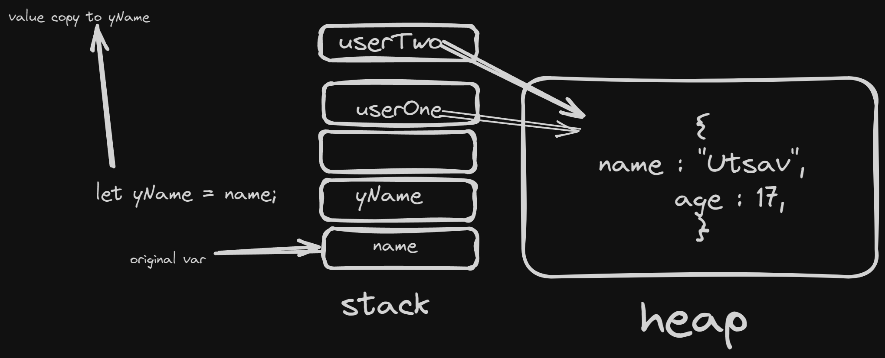

# JavaScript

## TOC

- [JavaScript](#javascript)
  - [TOC](#toc)
  - [Variables](#variables)
  - [DataType](#datatype)
  - [Type conversion And operations](#type-conversion-and-operations)
    - [MEMES WITH JS Addition 😵😂](#memes-with-js-addition-)
  - [Strings](#strings)
    - [Creating The stings](#creating-the-stings)
  - [Number and Math Object](#number-and-math-object)
    - [Declaring Number](#declaring-number)
  - [Date](#date)
  - [Array](#array)
  - [Object](#object)
  - [Functions](#functions)
    - [scopes](#scopes)
    - [IIFE (Immediately Invoked Function Expression)](#iife-immediately-invoked-function-expression)
  - [Notes](#notes)

## Variables

- `let` , `var` , `const` three way to declare variable in js
- `const` we can't change value , we must need to assign value when we use `const` it has block scope `{ // this is scope }`
- `let` value assign is optional we can reassign value and it has also block scope
- `var` is global scope alway in window object , now we don't use `var`
- if variable value is not assign then it set `undefined` as default value - it is very special
```js
let age = 18; // console.log(age) -> 18
let x;        // console.log(x) -> undefined
var p = 12;   // console.log(p) -> 12
var lol;      // console.log(lol) -> undefined
const y = 100 // console.log(y) -> 100
const me;     // SyntaxError: Missing initializer in const declaration
```
## DataType

- this are Primitive data types (most basics data types , may be some are immutable, call by value )

1. `number` - store numeric value even with floating points `let age = 18` , `let cgpa = 8.55`;
2. `string` - store array of character
3. `boolean` - only `true` and `false`
4. `null` - standalone value and datatype is `object` 
5. `undefined` - not assign value
```js
let name1 = "javascript";
//or
let name2 = "mark";
// or
let name3 = `hello`;
```
6. `symbol` - **always unique** added in `ES6`
7. `bigInt` - when we need to perform operations on larger number rarely used `let bigNum = 1234n;`

---
we use `typeof` key word to check datatype of the variable
```js
let name = "js";
console.log(typeof name); // string
let age = 18;
console.log(typeof age); // number
let arr = [1, 2, 3];
console.log(typeof arr); // object OMG
```

- famous interview question
  what is the output of this program

```js
console.log(typeof null);
console.log(typeof undefined);
```
---

<details>
 <summary>
  Answer
 </summary>

```js
object;
undefined;
```

- explanation :-
- `null` and `undefined` both are special value that represent the absence of a value / Data
- if you know JavaScript Execution context than read it otherwise [click here](/javascript/notes-of-js/02-part.md/#how-js-work) to read about js execution context

- null :-
  - `null` -> `object`
  - some people think this is is mistake in language design
  - null represent no value or no object , it need to be assign explicitly
  - it (may) be a bug in JavaScript implementation that why it return `type` for `null` is `object`
  - this bug never fix because it would broke existing code on the web.
- undefined:-
  - `undefined` is a primitive datatype and automatically assign to the all variable (even function parameter) due to phase 1 `memory creation` of javascript execution context
  - that why it return `type` for `undefined` is `undefined`

</details>

---

**Notes**

- JavaScript change over the time , means js in `2015` and js in `2024` (this notes writing time year) is very different
- once we write `"use strict"` all code in js file will treat as newer version of js
- JavaScript can run at both at client (by default in browser) and server (with help of `node js` , or other js runtime)
- code must be readable and easy to understand
```js
console.log(
  //
  3 +
    //
    //
    3
); // to bad
```
---

- Non-Primitive data types (call by references)

1. Array

```js
let arr = [
  1,
  3.14,
  "Hello",
  true,
  [4, 5, 6],
  {
    // this is object
    name: "Mark",
    age: 17,
  },
  function () {
    console.log("omg");
  },
];
```
2. Object - most IMP thing in js,it's key value pair or value with named index 

```js
let user = {
  name: "Utsav",
  age: 17,
  marks: [1, 2, 3],
  printName: function () {
    console.log(user.name); // utsav
    console.log(this.name); // Utsav
  },
};
user.printName();
```

3. Function

```js
function abc() {
  console.log("Hello World");
}
```
---

- two types of memory
- Stack (Primitive) , Heap (Non - primitive )
- stack memory - we get a copy of a variable
- heap memory - we get reference of variable (modification apply in even in original)
- some graphical representation 


## Type conversion And operations

- In js type conversion is very nightmare topic but not a impossible
- Js is dynamic type language not a static typed language means we don't need to define type of the variable
```js
let score = 100; // here we not specify the type of the variable
console.log(typeof score); // number
```
---

```js
let score = "100";
console.log(typeof score); // string
```

- we can convert the string type variable into number ⚠️

```js
let score = "100";
let newScore = Number(score); // now the string score convert into number
console.log(typeof newScore); // number
```

- till now nothing to confusing

```js
let score = "why i am score";
console.log(typeof score); // string

let newScore = Number(score); // we are trying to convert string variable into number

// HOW IS THIS POSSIBLE ?
// we know it is wrong
console.log(typeof newScore); // number
console.log(newScore); // NaN
```
- `"why i am score"` string can't convert into number that why it return `NaN`
- it is not a bug , but basically javascript try to convert in number but it can't convert so it return `NaN`

```js
let num = null;
let newNum = Number(num);

console.log(newNum); // 0
// null -> 0

let x = undefined;
let newX = Number(x);
console.log(newX);
// undefined -> NaN

let x = true;
let newX = Number(x);
console.log(newX); // 1

let x = false;
let newX = Number(x);
console.log(newX); // 0

let isLoggedIn = 1; // een "1" convert into true
let boolValue = Boolean(isLoggedIn);
console.log(boolValue); //  true
// for 0 numeric value its boolean value will be false

// level upgrade
let age = "Hello";

let boolValue = Boolean(age);

console.log(boolValue); // true

let wrongAge = "";
let bool2 = Boolean(wrongAge)
console.log(bool2); // false
// if "" convert into false

let spaceAge = " "; // space 
let bool3 = Boolean(wrongAge)
console.log(bool3); // true

let someNum = 10000;
let strNum = String(someNum);
console.log(strNum);
console.log(typeof strNum);

// and many more conversion possible
```

- about come conversion

| Value     | Conversion Type | Output | Output type |
| --------- | :-------------: | -----: | ----------: |
| "1"       |     Number      |      1 |      Number |
| "Bananas" |     Number      |    NaN |      Number |
| null      |     Number      |      0 |      Number |
| undefined |     Number      |    NaN |      Number |
| true      |     Number      |      1 |      Number |
| 1         |     Boolean     |   true |     Boolean |
| ""        |     Boolean     |  false |     Boolean |
| "hi"      |     Boolean     |   true |     Boolean |

- and more

* what is `NaN` ?
  - `NaN` stand for Not a Number
  - it check given parameter is **not a number** or not
  - its type is `number`
  - [go on numbers to read about NaN](#number-and-math-object)
  ```js
  console.log(isNaN("1")); // false due to type conversion
  // "1" -> 1
  console.log(isNaN("LOL")); // true
  ```
- `+` can use for string concatenations
```js
let str1 = "Hello ";
let str2 = "World !!!";
let str3 = str1 + str2;
console.log(str3);
// string concatenations
```

### MEMES WITH JS Addition 😵😂

```js
console.log(1 + "2"); // 12 in string
console.log("1" + 2); // 12 in string
console.log(1 + +"2"); // but 3
// 1  -> 1   
// +"2"-> 2
// 1 + 2 = 3 
console.log(1 + 2 + "3"); // 33
// 1 + 2 = 3
// 3 + "3" = 33
console.log("1" + 2 + 3); // 123
// "1" + 2 = "12"
// "12" + 3 = "123"
```

**Note** - almost all operators in programming language are same , so read your self [click here](https://developer.mozilla.org/en-US/docs/Web/JavaScript/Reference/Operators)

- in js we can compare two different datatype values which is completely wrong ❌👎 that why typescript came in to he picture
- here why it is wrong
```js
console.log(null < 0); // false 0 < 0
console.log(null > 0); // false
console.log(null == 0); // false
console.log(null >= 0); // true
console.log(null <= 0); // true

console.log(undefined < 0); // false even with < , > , <= , >=
```

- javascript have special operator call that compare value and even compare datatype of that value

```js
console.log(1 === 1); // true
// both are number
console.log(1 === "1"); // false
// string and number
```

## Strings

- sequences of character
- string can be represent as character of an array
- `"hi".__proto__` in `console`

### Creating The stings
- as string literals
```js
let str1 = "Hello JS";
let str2 = "Hello Js 2";
let str3 = `Hello Js 3`;
console.log(typeof str1, typeof str2, typeof str3); // string string string
```
- as Object _rarely_ used
```js
let strObj = new String("Hello String from String Object");
console.log(typeof strObj); // object
```
- we can access the string character using their index
```js
let str = 'Hello World';
console.log(str[0]); // H
```
`String.prototype`
- `length`
  - return the string length , count the character in string
  ```js
    let str = "Hello";
    console.log(str.length); // 4
  ```
----
- `charAt(index)`
  - return the character at specific index
   ```js
   let str = "Hello";
   console.log(str.charAt(1)); // 'e'
   console.log(str.charAt()); // 'H'
   ```
  - if index is `out of range` even for negative value than it return `' '` (empty string).
- `charCodeAt(index)` 
  - if we want the a `UTF-16` value from the index than we can use `charCodeAt(index)`
  ```js
    let a = "Hello World";
    console.log(a.charCodeAt()); // zero index 47
    console.log(a.charCodeAt(2)); // zero index 108
  ```
    - if we want to use negative values as index than we  can use `at(index)` 
    - negative values than it given index from last of the string 
    - `-1` -> last character 
    - `-2` -> second last character ..... so on 
- `concat(s1,s2,s3,sN)`
  - Combines the multiple string into one string
   ```js
   let str1 = "Hello";
   let str2 = "World";
   console.log(str1.concat(" ", str2)); // "Hello World"
   ```

- `includes(substr,position)`
  - it return `true` or `false` whether the given substring found in string 
  -  we can optional give index position to start searching by default is `0`
   ```js
   let str = "Hello World";
   console.log(str.includes("World")); // true
   ```

- `indexOf(searchString,fromIndex)`
  -  it return index of first occurrence of the give search string
  -  if given search string not found than it return -1
  ```js
   let str = "Hello World";
   console.log(str.indexOf("World")); // 6
  ```
  - if we have need from last than we can use `lastIndexOf()`
  ```js
   let str = "Hello World";
   console.log(str.lastIndexOf("l")); // 9
  ```
- `slice(beginIndex, endIndex)`
   - it cut and return the given as per begin and end index(not include)
    - it do not modify the original string
  ```js
   let str = "Hello World";
   let newStr = str.slice(2, 5); 
   console.log(newStr); // "llo"
   console.log(str); // "Hello World"
  ```

- `substring(indexStart, indexEnd)`
  - similar to `slice(beginIndex, endIndex)` , but include the end index
  - it do not modify the original string
  ```js
   let str = "Hello World";
   console.log(str.substring(0, 5)); // "Hello"
   console.log(str); // "Hello World"
  ```
- `substr(startIndex,endIndex)`
  - extract the string from `startIndex` to `endIndex` (endIndex not include)
  ```js
  let str = "Hello, world!";
  console.log(str.slice(0, 5));   // "Hello"
  console.log(str.slice(-6, -1)); // "world"
  ```
-  `Case Change`
     - `UpperCase` to `LowerCase` :- `'Hello Js'.toUpperCase()` - _output_-> `'HELLO JS'`
     - `LowerCase` to `UpperCase` :- `'Hello Js'.toLowerCase()` - _output_-> `'hello js'`

- `trim()`
  - Remove White Space from end and start of the sting and return the string
  ```js
   let str = "  Hello World  ";
   let a = str.trim(); 
   console.log(a); // "Hello World"
   console.log(str); //"  Hello World  "
  ```

  - we have more two option for removing white space from start `trimStart()` and removing space from end of the string `trimEnd()`

- `split(delimiter,limit)`
  - split (broke) the string as per delimiter into substring of array we can optional specify the maxLimit of split
   ```js
   let str = "Hello World";
   let a  = str.split(" "); 
   console.log(a) // ["Hello", "World"]
   console.log(str); // "Hello World";
   ```
   - if delimiter is not found than return original string as array
  ```js
   let str = "Hello World";
   let a  = str.split("x"); 
   console.log(a) // ['Hello World']
   console.log(str); // "Hello World";
   ```
- `replace(searchValue, newValue)`
  - replace the _first_ occurrences `searchValue` with `newValue`
  - it do not modify the original string
  ```js
   let str = "Hello World";
   let a = str.replace("World", "Everyone"); 
   console.log(a); // "Hello Everyone"
   console.log(str); //"Hello World"
  ```

  - if `searchValue` not found than it return original string
  - if we want to replace the all occurrence of the substring than we can use `replaceAll()`

- `startsWith(str,position)` and `endsWith(str,position)`
  - it check the given sting is string or ending with specific substr or not
  - return boolean values

   ```js
   let s = "Hello World";
   console.log(s.startsWith("H")); // true
   console.log(s.endsWith("D")); // false;
   ```

- string Operator :- `string1` + `string2` eg.:- `Hello ` + `World` = `Hello World`
- this is just a some overview of string `methods` and `properties`, for more info you can search on web , or [visit mdn](https://developer.mozilla.org/en-US/docs/Web/JavaScript/Reference/Global_Objects/String)

```js
let name = "Utsav";
console.log("Hello From " + name); // old way to concatenations
console.log(`Hello From ${name}`); // new way
// string literal
console.log(name[0]); // only U will print
console.log(name.length); // 5 print the length of a string

let chai = "green";
console.log(chai.__proto__); // GOD
console.log(chai.toUpperCase()); // "GREEN"
// convert into upper case
console.log(chai.toLowerCase()); // "green"
// convert into upper case
console.log(chai.charAt(1)); // r 
// it print character at any index

console.log(chai.charAt(chai.length + 1)); // if index is greater than string then " " will return

console.log(chai.charCodeAt(2)); // we get ascii value of any index

console.log(chai.indexOf("n")); // give index of sub string

// G R E E N
// 0 1 2 3 4

const subChai = chai.substring(0, 2); // ge start from g and end at e
const newSubChai = chai.slice(0, 2); // same as above
const negSubChai = chai.slice(-4, 3); //
// G R E E N
// 0 1 2 3 4

// -4 -> start from end of the string 'r'
// 3 -> start from the beginning of the sting only 'e' due it last index will exclude

console.log(negSubChai);

let stringArr = chai.split(""); // string convert into array as per splitter
// we can optional give maxSplit (limit)

console.log(stringArr);

console.log(chai.search("g")); // this method search character in string and return index
// if character not found than it return -1

console.log(chai.startsWith("l")); // this method check string start with sub string or not it return boolean value
// same we have endsWith

let str = "        utsav        ";

console.log(str.trim()); // remove white space from start and end from the string
// same we can remove space from the only start and end

let strX = "Hello World !!!";

console.log(strX.replace("o", ")")); // replace only first occurrences

// for all replacement replaceAll() method

let str = "my name is utsav";

console.log(str.includes("mark")); // this method check that string contains substring or not
```


## Number and Math Object

- In js `123` and `3.14` treat as number not a separate datatype like `c`, `c++` or any other language
- Number in js are very straight forward. it has very few methods
- `JS` also have `BigInt` datatype for extremely large number , but it doesn't replace normal numbers

### Declaring Number

```js
let n = 100;
let n1 = Number(100);
let n2 = new Number(100); // as object
```
---
- `toFixed(digit)` 
  - format the number using fixed Point notions 
  - return type will `String`
  - digit should be between `0` to `100`
  ```js
  let num = 123.456;
  console.log(num.toFixed(2)); // "123.46"
  console.log(num.toFixed('2')); // "123.46"
  console.log(num.toFixed('HI')); // "123"
  ``` 
-  `toString(radix)` 
  - Convert(return) number into string as per  `radix` by default value is `10`    
  - `radix` must be between `2` to `36` other wise throw `RangeError`      
   ```js
   10.toString(2) -> 1010  
   10.toString(3) -> 101  
   10.toString(4) -> 22  
   10.toString(5) -> 20  
   10.toString(6) -> 14  
   10.toString(7) -> 13  
   10.toString(8) -> 12  
   10.toString(9) -> 11  
   10.toString(10) -> 10  
   10.toString(11) -> a  
   // till 36 return value is a
   ```
- `Number.parseInt(value)`  and `parseInt(value)` , `Number.parseFloat(value)`  and `parseFloat(value)`
  - both are same `parseInt == Number.parseInt` - > `true`
  - both are same `parseFloat == Number.parseFloat` - > `true`
  - `parseInt(value)` and `parseFloat(value)` are available at Global
  ```js
  console.log(parseInt(100.2)) // 100 
  console.log(Number.parseInt(100.2)) // 100
  console.log(Number.parseFloat('121.12')) // 121.12
  console.log(parseFloat('121.12')) // 121.12
  ``` 
- `isNaN(value)` , `isFinite(value)`
  - `isNaN(value)` return `true` if given value is `Not a Number` other wise `false`
  - `isFinite(value)` return `true` if given value is `Finite` other wise `false`
```js
let num = 123; // normal variable declarations

let numWithNumber = Number(123); // using  number keyword

let numWithNewKeyword = new Number(123); // we create a number with number object with the help of new

console.table([num, numWithNumber, numWithNewKeyword]); // all are same

console.log(num.toString()); // now '123' convert into string so string method are can be apply

console.log(num.toFixed(2)); // 123.00
console.log(num.toFixed(3)); // 123.000

let newNum = 3.14;
console.log(newNum.toPrecision(1)); // 3
console.log(newNum.toPrecision(2)); // 3.1
console.log(newNum.toPrecision(3)); // 3.14
console.log(newNum.toPrecision(4)); // 3.140

let ranchosFatherSalary = 25000000; // from 3 idiots 😂
// we are unable to read it
// js : don't worry
console.log(ranchosFatherSalary.toLocaleString("en-in"));// 2,50,00,000
 // salary convert into as per indian standard

let max_num = Number.MAX_SAFE_INTEGER;
let min_num = Number.MIN_SAFE_INTEGER;
console.log(max_num, min_num);
// js can perform any operations on number between this numbers than it may create issue
// that why BigInt come
```

---

- Math Object

```js
console.log(Math.abs(-4)); // 4
// only negative to positive
console.log(Math.round(4.5));  // 5
// as per normal standard
console.log(Math.ceil(4.5));  // 5
// value up
console.log(Math.floor(4.5)); // 4
// value maintain 4

console.log(Math.pow(2, 3) === 2 ** 3); // true
// 9 === 9
// true that means both are same

console.log(Math.min(1, 2, 3, 4, 5, 6, 7, 8, 9, 0)); // give minimum number
console.log(Math.max(1, 2, 3, 4, 5, 6, 7, 8, 9, 0)); // give maximum number

// most important method

// Math.random() it give random number between 0 and 1

console.log(Math.random() * 10); // now value b/w 0 to 10
console.log(Math.random() * 10 + 1); // now value b/w 1 to 10

let min = 10;

let max = 100;

console.log(Math.floor(Math.random() * (max - min + 1) + min));
// now value always be 10 to 100
```

## Date

- Dates 🫣
- JavaScript `Date` objects represent a single moment in time in a platform-independent format
- js date start from mid night from 1 jan 1970 UTC
- date object calculate time in `millisecond` 
- month index start with `0`

```js
let date = new Date();
// YYYY-MM-DDTHH:mm:ss.sssZ
console.log(typeof date); // object
console.log(date);
// in node js - 2024-05-03T09:27:51.563Z // ISO string
// Wed Aug 21 2024 20:16:10 GMT+0530 (India Standard Time)
console.log(date.toString());
// Fri May 03 2024 14:59:35 GMT+0530 (India Standard Time)
// now readable

console.log(date.toDateString()); // Wed Aug 21 2024
console.log(date.toISOString()); // 2024-08-21T14:46:10.355Z
// a simplified format based on ISO 8601
console.log(date.toLocaleDateString()); // 8/21/2024
console.log(date.toLocaleTimeString()); // 8:16:10 PM

let myDate = new Date(2024, 1, 1); 
// this own date
// here month start from 0 (means 0 0 => jan , 1=> Feb ,....)

let myDate = new Date(2024, 1, 1, 22, 45, 90);
// note here second is 90 which is wrong but in output 30 second added to the next minutes
let indiaDate = new Date("2024-05-03"); 
console.log(indiaDate);  // Fri May 03 2024 05:30:00 GMT+0530 (India Standard Time)

let timeNow = Date.now(); // 1724252059625
// Date.now() -> time in millisecond
console.log(Date(timeNow)); // Wed Aug 21 2024 20:24:25 GMT+0530 (India Standard Time)

// full customization

date.toLocaleString("default", {
  weekday: "long",
  month: "short",
});

console.log(date);
```
----
```js
let date = new Date();

console.log(date.getFullYear());
console.log(date.getMonth());
console.log(date.getDay());
```
- we can retrieve date, year , full year, month, date , time ,hour ,second etc , even in UTC
[for more info visit mdn](https://developer.mozilla.org/en-US/docs/Web/JavaScript/Reference/Global_Objects/Date)

## Array

- in js array can store `any datatype`
- js array are resizable
- zero based indexing
- array type in object
```js
let arr = [1, 2, 3.14, true];

let hero = ["iron man", "spider man", "super man"];

const arrWithArr = new Array(1, 2, 3);

console.table(hero[0]); // iron man
console.table(hero[1]); // spider man
console.table(hero[2]); // super man
console.table(hero[3]); // undefined

arr.push(8, 9, 10); // add element at last
let removedEle = arr.pop(); // remove and return last element

// worst to method it take to much time to execute operation
arr.unshift("x", "y"); // add element at first and change all existing element index

let removedFirstEle = arr.shift(); // remove and return first element
let removedLastEle = arr.pop(); // remove and return last element

console.log(arr);
console.log(
  `Last Element removed ${removedLastEle},First Element removed ${removedFirstEle}`
);
// Last Element removed 9,First Element removed x

let arr = [1, 2, 3, 4, 5, 6, 7, 8, 9];

console.log(arr.includes(2)); // return boolean
console.log(arr.indexOf(0)); // -1 because 0 not available in arr

console.log(arr.join()); /// join into one string

// slice and splice

console.log(arr.slice(1, 4)); // return a copy for start and end section
// do not modify array

let partOfArr = arr.splice(1, 4); // last index include
console.log(arr); // hmm affect original array [main different b/w slice and splice]
console.log(partOfArr);

const marvel_heros = ["thor", "Ironman", "spiderman"];
const dc_heros = ["superman", "flash", "batman"];

marvel_heros.push(dc_heros); // go wrong array inside array

console.log(marvel_heros);
console.log(marvel_heros[3][1]); // flash

let numArr = [1, 2, 3];
let all_hero = marvel_heros.concat(dc_heros, numArr); // ok good

console.log(all_hero);
// new way  +++

let hero_all = [...marvel_heros, ...dc_heros]; // spread operator

console.log(hero_all);

let arr = [1, 2, 3, [4, [5, 6, [7, [8, 9]]]], 0];
// array inside array , at 4 level

// console.log(arr);
// convert into 1 array

// let singleArr = arr.flat(5); // 5 nested level can convert into aarray

// arr.flat(Infinity); at all level
// console.log(singleArr);

console.log(Array.isArray("Hello")); // return boolean value
// check given paramter is array or not

console.log(Array.from("Hello")); // convert into array

// console.log(Array.from({ name: "Utsav" })); // most intersing case return []

// console.log(Array.of({ name: "Utsav" }));

let num1 = 1;
let num2 = 2;
let num3 = 3;

let newArray = Array.of(num1, num2, num3);

console.log(newArray);
```

## Object

- any nested level of object possible
- Two way to declare object in `JS`
- 1. `Objcet Literal` - most simple way to decalre object
-

```js
// small example

let car = {
  name: "BMW",
  model: "i3",
  year: 2023,
};
```

- 2. `Object constructor` - with the help of function `learn later`
  - more complex example

```js
function Car(name, model, year) {
  this.name = name;
  this.model = model;
  this.year = year;
}

let bmwCar = new Car("BMW", "X6", 2020);
```

---

- `singleton` - when we create object with `objcet constructor` ,only one type of object

---

```js
let car = {
  name: "BMW", // in behinde name will treat as 'name'
  model: "i3",
  year: 2023,
};

// way to access object
console.log(car.name);
console.log(car["year"]);

let newObj = new Object({
  name: "BMW",
  model: "i3",
  year: 2023,
});

console.log(newObj == car); // both object store at differnt memory
console.log(Object.is(car, newObj));

user["email"] = "utsav@gmail.com"; // add at last

user["age"] = 100;
user["haveFourLeg"] = false;

user.greet = function () {
  console.log(`hello user`);
};

user.advanceGreet = function () {
  console.log(`Hello , ${this.name}`);
};

console.log(user);
user.greet();
user.advanceGreet();

// Object.freeze(user); // freeze the object no edit or no update
```

- possible interview question

1. how to use Symbol as objcet key ?

```js
let gender = Symbol("male");
let user = {
  name: "Utsav",
  age: 17,
  isStudent: true,
  // gender: "male", // not working
  [gender]: "male", // its a synatx and symboled key property
};

// console.log(typeof user.gender); // string insted of symbol
console.log(typeof user[gender]); // string insted of symbol
```

---

```js
let userOne = new Object(); // singletone object
let user = {}; // non object

console.log(user);
console.log(userOne);

user.id = 101;
user.name = "Sam";
user.isLoggedIn = false;
console.log(user);

console.log(Object.keys(user)); // all key put in one array
console.log(Object.values(user)); // all value put in one array

let userTwo = {
  id: 101,
  fullName: {
    userFullName: {
      firstName: "Utsav",
      lastName: "Dhimmar",
    },
  },
};

console.log(userTwo.fullName?.userFullName.firstName);
// merger two object
let objOne = {
  1: "a",
  2: "b",
};

let objTwo = {
  3: "c",
  4: "d",
};

let objThree = { objOne, objTwo }; // it create problem
let objThree = Object.assign({}, objOne, objTwo);
// here {} usefull when we have multiple object and it is optional
// if we don't write `{}` than all second source object copy into first object scource
let objFour = { ...objOne, ...objTwo }; // spread operator
console.log(objThree);
console.log(objFour);
```

- when we recive data from database majorly time data recevide in below format

```js
let data = [
  {
    id: 101,
    name: "Utsav",
  },
  {
    id: 102,
    name: "Sam",
  },
  {
    id: 103,
    name: "Mark",
  },
];

console.log(data[0].id);

// desctructiong object

let { name } = user;
let { name: userNaem } = user; // same as above just we give alternative name

console.log(name);
```

## Functions

- function are heart ❤️ of js

```js
function printSomething() {
  console.log("Hello World");
}

printSometh();

// simple program to add two numebr
function add(num1, num2) {
  return num1 + num2;
}
add();

// another simple program to print two number

function addTwoNum(num1 = 1, num2 = 1) {
  // default parameters
  if (typeof num1 !== "number" || typeof num2 !== "number") {
    throw new Error(
      `Both input ${typeof num1 !== "number" ? num1 : num2} must be number`
    );
  } else {
    return num1 + num2; // return to the caller
  }
}

console.log(addTwoNum(1, 12));
```

- rest opeartors

```js
function add(...num1) {
  // spread operator return array
  return num1;
}

console.log(add(1, 1, 2, 3, 4));
```

### scopes

- the whole story of scope come from `let` , `var` and `const`.
- almost in every language we have scopes (`html` and `css` not harm 😂)
- `var` is global scope

```js
if (true) {
  // this is scope of if tue block
}

function one() {
  const name = "Utsav";

  function two() {
    const age = 17;

    console.log(name);
  } // all the statement of function two destory here
  two();
  // console.log(age); // throw error
}

one();
```

```js
doSomething(); // work properly
function doSomething() {
  return `hello`;
}
hola();
let hola = function () {
  return `hello from hola function`;
};
```

- click here to read above thing

- arrow function and teaser of `this` keyword

```js
const arrow_fun = () => {
  console.log("Hello world");
};
const add = (num1, num2) => num + num2; // no need to return keyword
const lol = () => ({ username: "Utsav" });
```

- `this` keyword

```js
let user = {
  username: "Utsav",
  age: 17,
  welcomeMsg: function () {
    console.log(`Hello ${this.username}`);
  },
};

user.welcomeMsg();

console.log(this);
```

- in node this -> `{ }`
- in browser this -> `window object`

### IIFE (Immediately Invoked Function Expression)

- example

```js
(function () {
  // function body
})(); // function call
// anonyms iffe
```

- **IIFE** use full when we prevent variables , and any other statement from global scope from polluting global scope
- semi colon play important role for ending scope of **IIFE**

```js
(function () {
  let x = 12;
  console.log(x);
})() // here semi colon paly important role


console.log(x); // raised error

(function hello() {
  // named IIFE
})();

((name = "JS") => {
  console.log(name);
})("utsav");
```

---

## Notes

- **Note** - all the conditionals statement are same as `c`, `c++` or `java` so learn yourself !!!

- **Note** - all the iterative (`for`, `while` , `do....while`) statement are same as `c`, `c++` or `java` so learn yourself !!! , some iterative statement are available in part 2 :)
